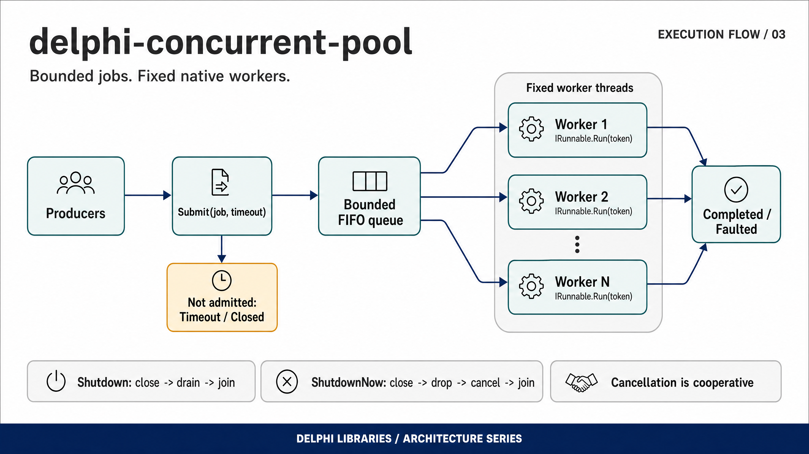

# ConcurrentPool

[](https://github.com/ramonruanxc/delphi-concurrent-pool/actions/workflows/ci.yml)
[](LICENSE)

A bounded blocking queue, a worker that owns its thread, and a fixed-size pool
that composes them — for Delphi and Free Pascal.

Four small units. Not a framework.

```pascal
Pool := TWorkerPool.Create(4, 32);        // 4 workers, queue of 32
try
  Pool.Submit(TMyJob.Create, 5000);       // waits up to 5 s if the queue is full
  Pool.WaitIdle(30000);

  Assert(Pool.Submitted = Pool.Completed + Pool.Faulted + Pool.Dropped);

  Pool.Shutdown(10000);                   // drain what is queued, then join
finally
  Pool.Free;
end;
```

---

## Execution flow



Producers submit jobs to a bounded FIFO queue. A fixed set of native workers
executes accepted jobs; submissions can time out or encounter a closed queue.
Shutdown drains work, while ShutdownNow drops pending jobs and requests
cooperative cancellation.

## Why not System.Threading, or TThreadedQueue

The first question a reviewer should ask, so it is answered before anything else.

`System.Threading` (`TTask`, `TParallel`) and `TThreadedQueue<T>` are
**Delphi-only**. Neither exists in Free Pascal — and Free Pascal is what makes it
possible to test a concurrency library in CI at all: Delphi cannot be licensed on
a hosted runner, and its Community Edition refuses command-line compilation even
locally. A library built on the RTL's threading types could only ever be tested
by hand, on one machine, by its author. For code whose entire subject is races,
that is not testing.

So the constraint came first and the design followed: `TThread`,
`TCriticalSection`, `TEvent` and the interlocked intrinsics — all of which exist
on both compilers — and a suite that runs on every push, including four builds
that deliberately remove a safety property and must fail.

**If you are Delphi-only and want a task API, use `System.Threading`.** This is
for code that has to build on both, or that wants its concurrency claims
checked rather than asserted.

It is also the second half of a pair.
[delphi-concurrent-log](https://github.com/ramonruanxc/delphi-concurrent-log)
ends its README saying that logging across a slow sink without blocking callers
wants "a queue in front of it — a sink that hands entries to a background writer
thread… intentionally left out of the core". `demo/AsyncSink.dpr` is that.

---

## Install

With [Boss](https://github.com/HashLoad/boss):

```
boss install github.com/ramonruanxc/delphi-concurrent-pool
```

Or add `src` to your search path. Requires Delphi 10.1 Berlin or later, or Free
Pascal 3.2 with `-Mdelphi`.

Every `.dpr` here lists its units with explicit `in '...'` paths, so opening one
in the Delphi IDE and building works with nothing to configure. Free Pascal
resolves units from `-Fu` and ignores those, so the FPC command lines below pass
the paths.

**Build the test suite with assertions on** (`-Sa`, or a Delphi debug config).
One of the safety mechanisms *is* an assertion; without it that test proves
nothing, and the suite says so at startup.

---

## The four units

```
Types  ->  Atomic  ->  Queue  ->  Worker  ->  Pool
```

A line, with no back-edges. `Types` holds what more than one unit needs, which is
why it exists at all.

### TAtomicCounter — `ConcurrentPool.Atomic`

A 32-bit interlocked counter. It is a **record**, and that is deliberate: the two
ways a record counter goes wrong are the interesting part of the unit, and both
are invisible to the compiler.

```pascal
type
  TThing = class
  public
    Handled: TAtomicCounter;    // valid: a class field
    constructor Create;
  end;

constructor TThing.Create;
begin
  inherited Create;
  Handled.Init;                 // required, once
end;
```

Valid as a class field, a global, or an array element — **after `Init`**. Not
valid as a local, a value parameter, or a `const` parameter. Rather than leave
that as documentation, a guard makes both mistakes fail loudly on first use:

- an **uninitialised local** is not zeroed (measured: it read back `22735472` on
  FPC/i386-win32, `-1599891312` on FPC/x86_64-linux and `7060772` on
  Delphi 12), so its magic field is garbage and the guard trips;
- a **by-value copy** moves the record, so `@Self` stops matching and the copy
  trips on its first mutation.

Return values follow Delphi's `TInterlocked`, so porting code does not silently
change meaning: `Increment`, `Decrement` and `Add` return the value **after**;
`Exchange` and `CompareExchange` return the value **before**.

### TBoundedQueue&lt;T&gt; — `ConcurrentPool.Queue`

A ring with a lock and **two manual-reset events whose signalled state mirrors
the predicate**.

```pascal
function Push(const AItem: T; ATimeoutMs: Cardinal): TQueueWait;
function Pop(out AItem: T; ATimeoutMs: Cardinal): TQueueWait;
procedure Close;
function DrainAndClose: Integer;
```

`TQueueWait` has three values, not two, because two cannot be acted upon:
`qwTimeout` means *try again*, `qwClosed` means *stop, forever*. A Boolean
collapses them and makes the pool's drain loop unimplementable.

Manual-reset is not a style preference. An auto-reset event is a binary latch —
two pushes in quick succession wake one consumer and the second item sits
unnoticed (measured) — and `SetEvent` on one releases exactly one waiter, where
`Close` has to release all of them. Measured on both targets: one `SetEvent` on a
manual-reset event released four parked waiters, and a waiter arriving afterwards
passed with no further signal.

`Close` is a **latch**: once closed, both events are set and never reset, so a
thread arriving later still finds them signalled. That is what makes *producer
parked on a full queue, then Close* return `qwClosed` instead of hanging — the
deadlock bounded queues usually ship with.

The full state matrix, tested line by line:

| | |
| --- | --- |
| push, room available | `qwOK` |
| push, full | blocks to the deadline → `qwTimeout` |
| push parked, then `Close` | `qwClosed` |
| push after `Close` | `qwClosed`, immediately |
| pop, items present (even after `Close`) | `qwOK` — drains first |
| pop, empty and open | blocks to the deadline → `qwTimeout` |
| pop, empty and closed | `qwClosed` |
| `Push(x, 0)` / `Pop(x, 0)` | try only, never blocks |
| `Close` twice, from any thread | no-op, never raises |

`Count` is **advisory** — true when read, stale the moment you act on it.

### TWorker — `ConcurrentPool.Worker`

Owns a `TThread` it never exposes: no `Handle`, no `Priority`, no `Suspend`, no
`Resume`. Re-publishing the footguns this unit removes would undo the point.

- **No thread until `Start`.** Destroying a worker that was never started has
  nothing to wait on, which removes the never-started-suspended-`TThread`
  hazard entirely.
- **`Destroy` joins, unconditionally.** `Execute` reads the worker's fields, so
  abandoning a live thread and then freeing the object is a use-after-free, and
  `TerminateThread` leaks whatever locks that thread held. Cancellation is
  cooperative; a task that never checks its token cannot be stopped; `Destroy`
  blocks until `Run` returns. `WaitFor(timeout)` exists so a *caller* can decide
  what to do about a slow worker — a destructor is not offered that choice.
- **Self-join raises** `EPoolSelfJoin` instead of waiting forever. A hang gives
  no stack, no message, and burns a CI runner until the job times out.
- **Faults are captured, not swallowed.** An exception that escapes `Execute`
  lands in `TThread.FatalException`, which nothing reads — the thread just
  "ends" and the work disappears. `FaultClassName` and `FaultMessage` are
  recorded instead. The handler has a bare `else` because `on E: Exception` does
  not catch `raise TObject.Create` (measured on both compilers).

Cancellation is an interface with **two** methods:

```pascal
ICancellationToken = interface
  function IsCancelled: Boolean;
  function WaitCancelled(ATimeoutMs: Cardinal): Boolean;
end;
```

`WaitCancelled` is the one that earns the interface. A poll-only token cannot
release a task that is parked in a wait, so `Cancel` followed by a join would
deadlock by design. `demo/Pipeline.dpr` shows a parked task released in a few
hundred milliseconds instead of waiting out a 30-second timeout.

### TWorkerPool — `ConcurrentPool.Pool`

Visibly a composition of the other three, which is the point.

```pascal
function Submit(const ARunnable: IRunnable; ATimeoutMs: Cardinal = 0): TQueueWait;
function WaitIdle(ATimeoutMs: Cardinal): Boolean;
function Shutdown(ATimeoutMs: Cardinal): Boolean;      // drain, then stop
function ShutdownNow(ATimeoutMs: Cardinal): Boolean;   // abandon, then stop
```

Two named methods rather than a Boolean parameter, because `Shutdown(True)`
tells the reader nothing. `Submit` is non-blocking by default; pass a timeout to
get back-pressure. After a shutdown it returns `qwClosed` — it never raises and
never blocks.

The accounting is an **invariant, not a report**:

```
Submitted = Completed + Faulted + Dropped
```

asserted at the end of every pool test. That is a race-free proof that work is
never lost and never run twice, which is a much stronger statement than *a
counter reached N*.

---

## Structural rules

1. **Locks are leaf-level.** No component calls user code, another component, or
   an allocation-heavy operation while holding a lock. `Item.Run` is invoked with
   nothing held, which is why submitting from inside a running task works — and
   why there is no lock nesting in the library, so no lock order to invert.
2. **Every public method takes its lock exactly once**, doing its work through
   non-locking private helpers. Re-entrancy is never relied on, so it does not
   matter whether `TCriticalSection` is a recursive mutex on a given platform. A
   `Count` that locked, called from inside a `Push` that already held the lock,
   would work on Windows and deadlock on Linux — the worst possible split.
3. **No `Sleep` in `src/`.** Waiting is on events whose state mirrors a
   predicate.
4. **Every wait in `tests/` is bounded.** `WAIT_INFINITE` does not appear there.

---

## Tests, and the four negative builds

```
mkdir -p build/normal
fpc -Mdelphi -Sa -Fusrc -Futests -FUbuild/normal -obuild/Tests tests/Tests.dpr
./build/Tests
```

96 assertions. `--no-guards` skips the one test that raises on purpose, so a
debugger session is not interrupted.

**A concurrency test that always passes proves nothing.** Each build below
removes exactly one safety property, and CI fails if the suite still passes.
Each gets its own `-FU` directory, because Free Pascal does not treat a changed
`-d` define as a reason to recompile — sharing one would silently reuse the
protected units and make the check meaningless.

| Build | Removes | Result |
| --- | --- | --- |
| `-dPROVE_SWALLOW` | the worker's `try/except` | 8 assertions fail. Deterministic: no timing component, any core count, any OS. |
| `-dPROVE_NOWAKE` | the `SetEvent`s in `Close` | 2 assertions fail — the latency ones. |
| `-dPROVE_RACE_QUEUE` | the lock around the ring indices | items lost or duplicated; the bitmap assertion fires. |
| `-dPROVE_RACE_ATOMIC` | the interlocked mutators | increments lost. **Statistical** — see below. |

`PROVE_NOWAKE` is worth a note, because writing it taught me something about my
own design. Removing the wakeups does **not** hang this queue: the parked thread's
`WaitFor` expires, the loop re-checks the predicate under the lock, sees the
closed flag and returns `qwClosed`. Correctness comes from the bounded re-check
loop; the events supply *promptness*. A test that only checked the result would
therefore have passed with the wakeups removed — five seconds later. So the
assertions are on latency, which is the property the events actually provide.

`PROVE_RACE_ATOMIC` is the only proof here that is not airtight: observing a lost
update needs real parallelism, and the CI runner has two cores. The window is
widened deliberately in that build, and CI retries it up to three times. It is
not the proof this README leads with, and the deterministic ones stand on their
own.

### The watchdog

Every hazard in this library fails by **blocking**. A lost wakeup, a self-join, a
missing release — none produce a wrong value, they produce a process that never
returns, which tells you nothing and names nobody.

So the runner keeps a watchdog thread and halts with the test's name:

```
WATCHDOG: test "an empty Pop with a deadline waits, then times out" exceeded 0 s
and is presumed deadlocked.
```

CI verifies the watchdog rather than assuming it: `Tests --watchdog=0` arms it
immediately and must exit 2 having named a test. An earlier version cleared the
test name after each assertion, which left the watchdog blind between them —
exactly where two of the negative builds hung, so it reported nothing.

### The leak gate

CI builds the suite again with `-gh -gl` and greps heaptrc's output. Grepping is
mandatory: a deliberate leak produced `1 unfreed memory blocks : 8` while the
process still **exited 0**, so a naive step passes silently. The pattern is
anchored, because an unanchored `0 unfreed memory blocks` also matches
`10 unfreed memory blocks`.

---

## Demos

```
fpc -Mdelphi -Fusrc -FUbuild -obuild/AsyncSink demo/AsyncSink.dpr && ./build/AsyncSink
fpc -Mdelphi -Fusrc -FUbuild -obuild/Pipeline  demo/Pipeline.dpr  && ./build/Pipeline
```

**`AsyncSink`** puts a bounded queue in front of a deliberately slow sink and
runs the same 400 lines twice — once with back-pressure, once dropping — so the
trade-off is a number rather than a paragraph. A representative run:

| | back-pressure | dropping |
| --- | --- | --- |
| offered | 400 | 400 |
| accepted | 400 | 17 |
| elapsed | 6141 ms | 266 ms |

**`Pipeline`** shows a task that throws not taking its worker down (70 jobs, 10
faults, 4 workers still alive) and cancellation reaching a task that is parked
rather than polling — released in ~300 ms instead of its 30-second timeout.

---

## Out of scope

- **Futures or per-task results.** `IRunnable` returns nothing. A result type
  wants cancellation propagation, continuations and exception marshalling; that
  is a different library.
- **Work stealing, dynamic sizing, priorities.** Fixed size, one shared queue.
  Anything else needs a benchmark to justify it, and there is none here.
- **Anonymous-method callbacks.** Free Pascal 3.2 has no `reference to
  procedure` — it does not parse. Callbacks are interfaces or `of object`, and
  `AsRunnable` wraps a method so a one-line task costs one line.
- **`TMonitor`, `TInterlocked` as the portable path.** Delphi-only; measured
  absent on FPC 3.2. `TInterlocked` is used on Delphi behind the shim in
  `ConcurrentPool.Atomic`.

---

## Licence

MIT. See [LICENSE](LICENSE).
